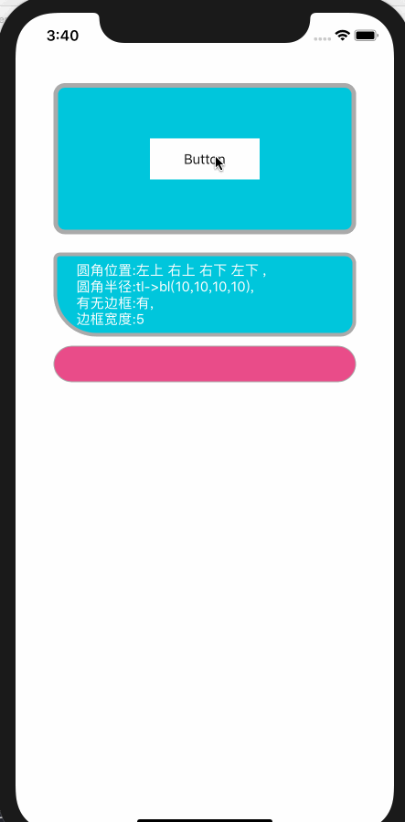
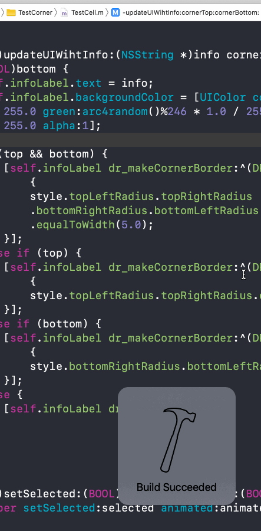

# DRCornerView


> 老规矩上图






### 做出的修改


1. 修改边框的绘制逻辑：
	
	现在使用
	
	```
	[cornerPath addCurveToPoint:fPoint controlPoint1:eControlPoint controlPoint2:fControlPoint];
	```
	
	来添加绘制`RectCorner`。
	
	好处是：
	
	圆角后添加描边不需要再次计算圆角路径并且添加的描边不会再有超出添加圆角视图的`bounds`这样的BUG(这会导致很多不好的呈现效果)；
	
	可以控制每个角的圆角半径(虽然看似用处不大)；
	

2. 代码调整,支持了链式调用，测试代码如下：

  ```
  [self.cornerBGView dr_makeCornerBorder:^(DRCornerBorderStyle * _Nonnull style) {
        style.coverBGColor.equalTo(UIColor.whiteColor)
        .cornerLineWidth.equalToWidth(lineWidth)
        .cornerBorderColor.equalTo(UIColor.lightGrayColor)
        .topLeftRadius
        .topRightRadius
        .bottomRightRadius
        .bottomLeftRadius
        .equalToWidth(radius);
    }];
  ```

3. 测试用例
	
	测试用例保存在`example`文件夹中；


#### 备注：

 `coverBGColor`非必要参数，这个参数适用于添加圆角处理的view的supView的bgColor为`clearColor`时，传入你实际需要覆盖的颜色；
 